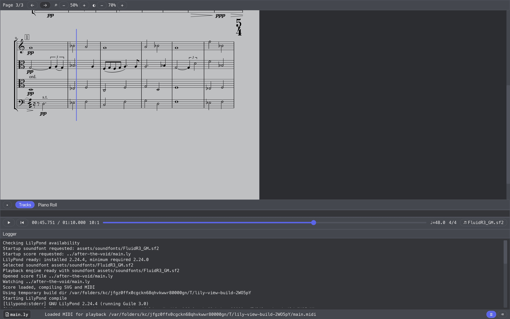
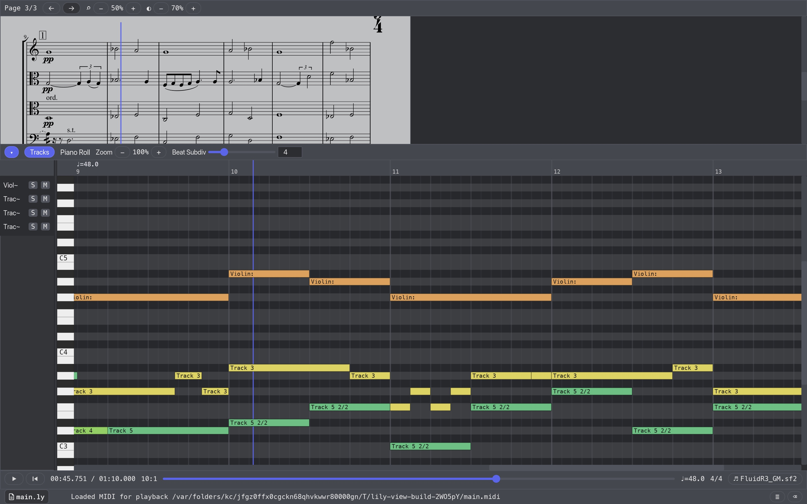

# lily-view

**lily-view** is a desktop app for working on LilyPond scores with immediate
visual feedback. Open a `.ly` file, keep it under watch, and the app updates its
generated output in one place while you edit.




Features:

- score preview
- piano roll visualisation
- MIDI playback with seek and cursor following
- logger

Run it with:

```bash
cargo run --release
```

## CLI Arguments

They mostly exist for development, you can do these things using UI.

You can preload a SoundFont on startup with `--soundfont`, for example:

```bash
cargo run -- --soundfont assets/soundfonts/FluidR3_GM.sf2
```

The same can be set via environment variable:

```bash
LILY_VIEW_SOUNDFONT=assets/soundfonts/FluidR3_GM.sf2 cargo run
```

You can also preload a LilyPond score file on startup with `--score` (or
`--file`), for example:

```bash
cargo run -- --score path/to/score.ly
```

The same can be set via environment variable:

```bash
LILY_VIEW_SCORE=path/to/score.ly cargo run
```

## Tests

Testing currently combines Rust unit tests and manual startup error-path checks.

```bash
cargo test
```

Manual startup error-path checks are provided under
`scripts/lilypond-error-tests`.
