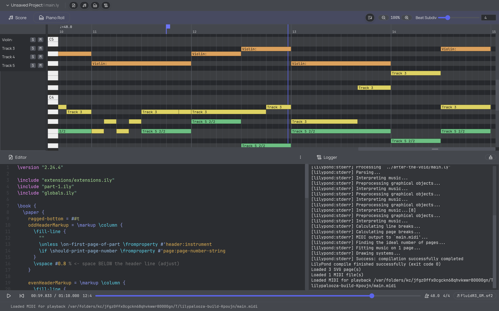
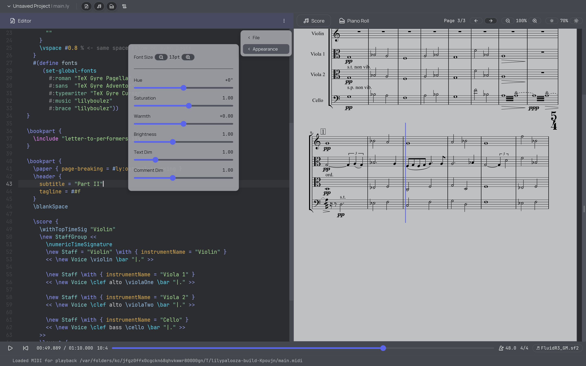

# Lilypalooza

**Lilypalooza** is a LilyPond IDE.

It is built for writing, previewing, navigating, and playing LilyPond projects
in one place instead of bouncing between a text editor, a PDF viewer, and MIDI
tools.




Current features:

- code editor with LilyPond-focused treesitter-based syntax highlighting
- score preview
- piano roll visualisation
- MIDI playback with seek, rewind, and cursor following
- dockable multi-pane workspace
- project persistence
- logger

Run it with:

```bash
cargo run --release
```


## CLI Arguments

They mostly exist for development. The normal workflow is through the UI.

You can preload a SoundFont on startup with `--soundfont`, for example:

```bash
cargo run -- --soundfont assets/soundfonts/FluidR3_GM.sf2
```

The same can be set via environment variable:

```bash
LILYPALOOZA_SOUNDFONT=assets/soundfonts/FluidR3_GM.sf2 cargo run
```

You can also preload a LilyPond score file on startup with `--score` (or
`--file`), for example:

```bash
cargo run -- --score path/to/score.ly
```

The same can be set via environment variable:

```bash
LILYPALOOZA_SCORE=path/to/score.ly cargo run
```

## Tests

Testing currently combines Rust unit tests and manual startup error-path checks.

```bash
cargo test
```

Manual startup error-path checks are provided under
`scripts/lilypond-error-tests`.
